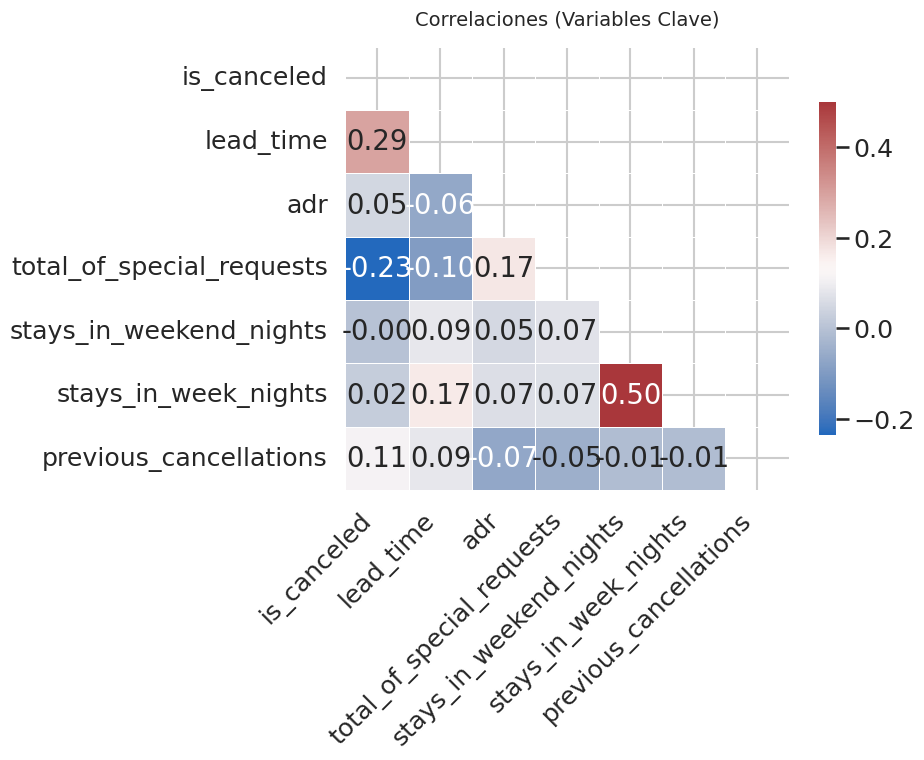
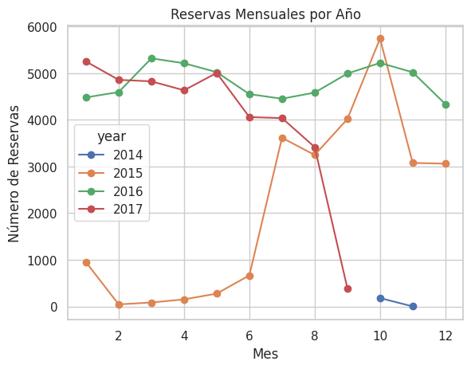
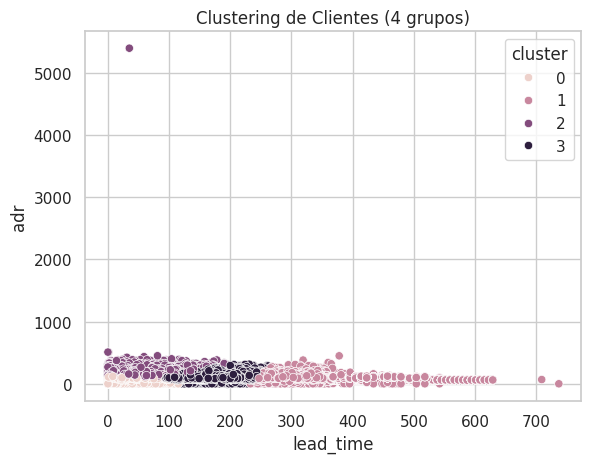

# 📊 Hotel Booking Data Analysis

[]()

Este proyecto realiza un análisis completo del comportamiento de las reservas hoteleras usando un dataset real de hoteles. El objetivo principal es detectar patrones de demanda, entender el comportamiento de los huéspedes y generar recomendaciones de negocio basadas en los datos.


## 📂 Dataset
- **Nombre:** Hotel Booking Demand Dataset
- **Fuente:** [Kaggle - Hotel Booking Dataset](https://www.kaggle.com/datasets/mojtaba142/hotel-booking)

## 🎯 Objetivos del Proyecto
- Validar y limpiar los datos de reservas.
- Realizar un Análisis Exploratorio de Datos (EDA) para entender patrones de cancelaciones, estacionalidad y canales de reserva.
- Generar visualizaciones que soporten los hallazgos.
- Aplicar técnicas de machine learning para predecir cancelaciones.
- Proponer recomendaciones de negocio basadas en los hallazgos.

## ⚙️ Herramientas utilizadas
- **Python 3**
- **Pandas** para manejo de datos
- **Matplotlib y Seaborn** para visualización
- **Scikit-Learn** para modelado predictivo (Regresión Logística)
- **Google Colab** para desarrollo del proyecto

## 📈 Análisis Realizado

- Limpieza de datos (tratamiento de nulos, duplicados y formatos).
- Análisis de estacionalidad de las reservas.
- Distribución de reservas por canal de origen.
- Análisis de correlaciones entre variables.
- Agrupación de huéspedes mediante clustering.
- Modelo predictivo para la cancelación de reservas.

## 📊 Visualizaciones Principales

### 1. Matriz de Correlaciones


---

### 2. Distribución de Cancelaciones


---

### 3. Estacionalidad de Reservas


---

### 4. Canales de Distribución


---

### 5. Clustering de Clientes


---

## 🧠 Principales Hallazgos

- 37 % de las reservas fueron canceladas.
- Los meses con mayor demanda fueron **Julio** y **Agosto**.
- **TA/TO** fue el principal canal de reservas (58.7 %).
- `lead_time` (tiempo de antelación) tuvo una correlación positiva con la probabilidad de cancelación.
- Los huéspedes que realizan **special requests** tienen una menor tasa de cancelación.

## 💡 Recomendaciones de Negocio

- Implementar políticas de cancelación más estrictas para reservas hechas con mucha antelación.
- Incentivar los **special requests** ofreciendo paquetes personalizados para aumentar la retención.
- Optimizar campañas de marketing enfocándose en los canales de distribución más rentables.
- Ajustar precios y ofertas estratégicamente durante temporadas de alta y baja demanda.

## 📋 Limitaciones del Estudio

- El dataset se centra en un único conjunto de hoteles y no incluye factores externos como eventos locales o competencia.
- Los datos analizados son históricos y no reflejan cambios recientes en comportamiento de clientes post-pandemia.
- El modelado predictivo fue básico; se podrían aplicar modelos más robustos como Random Forest o XGBoost.
- No se integraron variables de precios o promociones en el análisis.

## 🚀 Próximos pasos

- Aplicar técnicas avanzadas de machine learning para mejorar la predicción de cancelaciones.
- Enriquecer el análisis incorporando datos externos como eventos, clima o precios de la competencia.
- Crear dashboards interactivos para la visualización dinámica de métricas de negocio.

## Cómo Correr el Proyecto

1. Clona el repositorio:
   ```bash
   git clone https://github.com/AndresBenit/hotel-reservations-analysis.git
   cd hotel-reservations-analysis

---

## 📚 Autor

**Andres Felipe Benitez Grajales**  
Data Analyst & Data Enthusiast 🚀  
[www.linkedin.com/in/andrés-felipe-benitez-grajales](https://www.linkedin.com/in/andres-felipe-benitez-grajales
)
